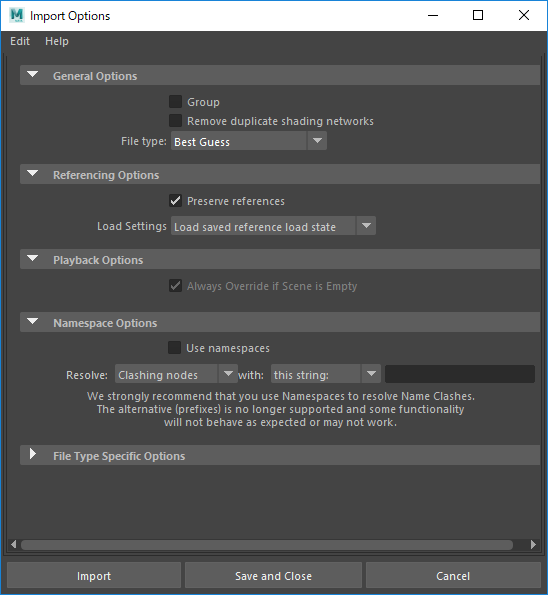

# 概要
maya用の車の汎用リグです。
ロケータをアジャストしてスクリプトを実行すると簡易的な車のリグが出来ます。

# 使い方
1. 車のシーンを開きます。
2. ワールドZ方向を進行方向として車を配置。
3. タイヤの接地部分をワールドY=0に配置。
4. 全体をフリーズし、CarRig.mbをインポート（インポート設定は下記画像参照）
5. typeMesh1を車の名前にします。
6. heightロケータで加重コントローラの高さを決めます。
7. タイヤの中心にtireロケータをアジャストします。
8. スクリプト実行
9. tire_XXGPにそれぞれのタイヤのメッシュを入れます。（ここにはハンドル操作に追従し、かつ回転するものを入れます。）
10. tire_XXSubGPにブレーキパッドのメッシュを入れます。（ここではハンドル操作にのみ追従するものを入れます。）
11. bodyGPにボディメッシュを入れます。
12. サスペンションなどの余ったメッシュはall_ctrl直下に入れます。（グループ化しても問題ないです。）

## タイヤの中心が取れないとき
タイヤの中心に頂点がない場合は、これでなんとかなるのでぜひ使ってみてください。

下記ツールを実行すると選択した頂点の平均座標のロケータを作成します。
円周上に選択して実行すれば中心が取れます。
[centerLocator](https://github.com/patriot6991/centerLocator)
